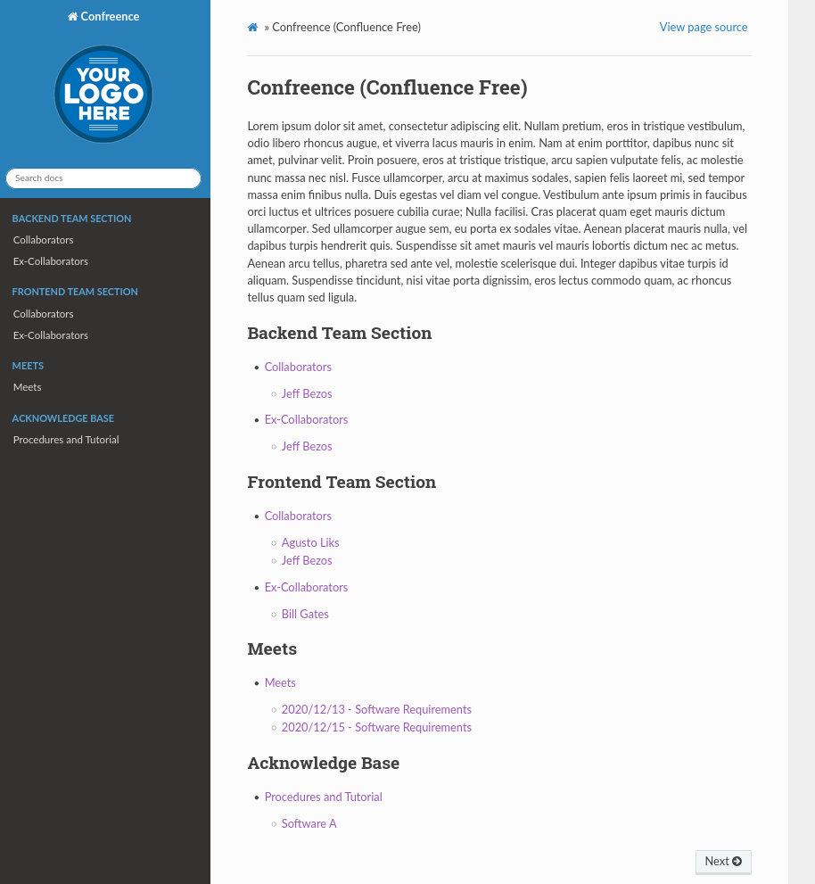

# Confreence

Confluence, but free :smile:

Preview:



## Requirements

Name            | Version  
:---            | :---:   
python          | >= 3.6  
pip             | >= 3.6  
docker          | 19.03.11

## Repository Layout

```shell
.
├── docs
│ ├── make.bat                          # On Windows, this file contains the definition of the .rst transpilation command, present in docs/source/*
│ ├── Makefile                          # On Linux, this file contains the definition of the .rst transpilation command, present in docs/source/*
│ ├── requirements.txt                  # Dependencies to perform tranpilation, contains sphinx and its extensions
│ └── source                            # Directory that concentrates the project's source code
│ ├── conf.py                           # sphinx configuration file
│ ├── doc                               # Directory containing all .rst files, containing the contributors report
│ │ ├── <TEAM>                          # Reports from employees
│ │ | ├── employers-off                 # Legacy reports from former employees
│ │ | │ ├── <LAST-DAY-OF-CONTRIBUTOR-YYYY-MM-DD>-<FULL-NAME-OF-CONTRIBUTOR>       # Directory that concentrates the content of the contributor. This directory receives the last day of work concatenated with the full name without spaces and special characters of the collaborator
│ │ | │ | ├── assets                    # [OPTIONAL] Directory containing image files used in reports
│ │ | │ | | └── *.jpg|png|csv           # Static files possibly used in reports
│ │ │ │ | ├── report-<YEAR>.rst         # reports separated by year
│ │ | │ | └── main.rst                  # .rst file containing professional information
│ │ | │ ├── _index.rst                  # .rst file that contains the index for the present section, that of former collaborators
│ │ | │ └── ...                         # Too many directories for other ex-collaborators with the same structure...
│ │ | └── employers-on                  # Reports from current employees
│ │ | ├── <FULL-NAME-OF-CONTRIBUTOR>    # Directory that concentrates the content of the contributor. This directory receives its full name without spaces and special characters
│ │ | | ├── assets                      # [OPTIONAL] Directory containing image files used in reports
│ │ | | | └── *.jpg|png|csv             # Static files possibly used in reports
│ │ │ │ ├── report-<YEAR>.rst           # reports separated by year
│ │ | | └── main.rst                    # .rst file containing professional information
│ │ | ├── _index.rst                    # .rst file that contains the index for the present section, that of former collaborators
│ │ | └── ...                           # Too many directories for other ex-collaborators with the same structure...
| | └── meets                           # Directory that concentrates meeting reports
| | | ├── <DATE-OF-MEETING-YYYY-MM-DD>  # Directory that receives as the name, the date on which the meeting was held
| | | │ ├── assets                      # [OPTIONAL] Directory containing image files used in reports
| | | │ │ └── *.jpg|png|csv             # Static files possibly used in reports
| | | │ └── <MEETING-DATE-MM-YYYY>-<MEETING-AGENDA>.rst     # Meeting content, in .rst format
| | | ├── _index.rst                    # .rst file containing the Meetings session index
| | | └── ...                           # Other directories for other meetings, the same structure is preserved...
| | └── ack-base                        # Directory that concentrates the procedures and manuals of the photosensor
| | ├── _index.rst                      # .rst file that contains the index of the Knowledge Base session
| | ├── <SUBJECT>                       # [OPTIONAL] Directory that receives as the name, the date the procedure/manual was performed
| | │ ├── assets                        # Directory containing image files used in procedure/manual
| | │ │ └── *.jpg|png|csv               # Static files possibly
| | │ └── <SUBJECT>.rst                 # Meeting content, in .rst format
| | └── ...                             # Other directories for other procedures/manuals, the same structure is preserved...
│ ├── index.rst                         # Main .rst file, which contains the infra and development sessions.
│ ├── _static                           # Static page layout files
│ │ └── logo.png                        # logo that is present in the sidebar
│ └── _templates                        # Template files, layout extensible
├── nginx-config        
│ └── default.conf                      # nginx configuration file to render transpiled files
├── Dockerfile                          # Dockerfile that transpiles the source and embedding in nginx
└── README.md                           # Project documentation
```

## Setup

```shell
$ git clone 
$ cd docs/
$ make setup
$ make html
$ google-chrome build/html/index.html 
```

## Add Images

```rst
.. image:: assets/<IMAGE-NAME>
  :height: 300px
  :width: 750 px
  :scale: 50 %
  :align: center
```

## References

- https://docutils.sourceforge.io/docs/user/rst/quickref.html
- https://pt.wikipedia.org/wiki/ReStructuredText
- https://www.sphinx-doc.org/en/master/
